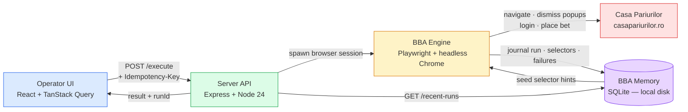

# BBA Memory — Architecture Overview

**Audience**: CEO / CTO (technical overview, no code detail required)  
**Read time**: ~3 minutes  
**Full operator script**: [`docs/bba-memory-demo-dry-run.md`](bba-memory-demo-dry-run.md) (operator link — not yet on master; see PR #24)  
**Full deployment guide**: [`docs/bba-memory-deployment.md`](bba-memory-deployment.md)

---

## What It Does

BBA Memory is the operator-facing interface for a multi-agent sports betting workflow. An operator selects a bet opportunity — match, stake, and odds — and clicks "Place Bet" in a web UI. The system then opens a headless Chrome browser, navigates to casapariurilor.ro, dismisses popups, logs in if the session expired, locates the bet form, and submits. Every step is journaled to a local SQLite database: what selectors worked, what popups appeared, whether a CAPTCHA triggered. Over time the system learns which DOM paths are stable, reducing fragility. Every placed bet is auditable — replay the Playwright trace to see exactly what the browser did, second by second.

---

## System Diagram

---

## Data Flow

1. **Operator picks a bet** in the UI — fills match, stake, odds in the Playground form.
2. **Clicks "Place Bet"** → confirmation modal opens with a full bet summary.
3. **Types "CONFIRM"** — deliberate friction, prevents mis-clicks from placing real money.
4. **Clicks "Place Real Bet"** — UI generates a UUID `Idempotency-Key` and sends `POST /execute` to the server.
5. **Server checks the idempotency cache** (SQLite `idempotency_keys` table, 60s TTL). Cache hit → returns the cached response immediately, no browser launch.
6. **Cache miss → server spawns a Playwright browser session.** BBA Engine navigates to Casa, applies seeded selector knowledge to find UI elements, dismisses known popups, and submits the bet.
7. **Every action journaled**: run row inserted in `runs`, each selector attempted recorded in `selectors_observed`, failures in `failures`, popups in `popups_seen`.
8. **Server returns the result** — `status`, `outcome`, `placedBetId` — and writes the response to the idempotency cache.
9. **UI displays result**: ✅ success / ⚠ partial / ❌ failure + failure class.
10. **Recent Runs panel auto-refreshes** via TanStack Query polling — new row appears at the top within seconds.

---

## Components

| Component | Stack | Responsibility |
|---|---|---|
| **Operator UI** | React 18 + TanStack Query + Tailwind CSS | Bet placement form, two-step confirmation modal, recent runs history, outcome display |
| **Server API** | Express + Node.js 24 | Request routing, auth, company isolation, idempotency enforcement, rate limiting |
| **BBA Engine** | Playwright + Chromium (headless) | Headless browser automation: navigate, dismiss popups, log in, find bet, submit |
| **BBA Memory** | SQLite via `node:sqlite` (built-in, no native dep) | Run journal, selector learning (hit/miss counters), failure taxonomy, idempotency cache |
| **Casa Pariurilor** | (external — casapariurilor.ro) | The bookmaker; receives the bet placement request |

---

## Safety Mechanisms

- **Two-step confirmation**: the operator must read the bet summary and type the word `CONFIRM` before submission — a mis-click cannot place a real bet.
- **60-second idempotency window**: the server stores a `Idempotency-Key` UUID after each execution. A retry within 60 seconds with the same key returns the cached response — the bookmaker never sees a duplicate request.
- **Per-company rate limit**: maximum 10 placement attempts per 60-second window per company — prevents a runaway automation loop from exhausting the bookmaker account or triggering a ban.
- **CAPTCHA detection**: if the BBA Engine detects a CAPTCHA challenge at any step, it immediately aborts, journals the run as `CAPTCHA_VISIBLE`, and returns an error. It does not attempt to guess or bypass.
- **Playwright trace capture**: every run records a `trace.zip` archive. Open it in Playwright Trace Viewer to replay the browser session frame-by-frame — full audit trail for any disputed outcome.

---

## Tech Highlights

Built on the open-source [Paperclip](https://github.com/paperclipai/paperclip) agent orchestration platform. The BBA Memory layer uses Node 24's built-in `node:sqlite` module — zero native dependencies, no compilation step, no separate database process. The UI uses TanStack Query for declarative server-state management with automatic background polling and cache invalidation. The server is plain Express — no heavy framework overhead. Total BBA Memory subsystem: approximately 6,000 lines of TypeScript across ~30 files, all additions to the Paperclip fork.
